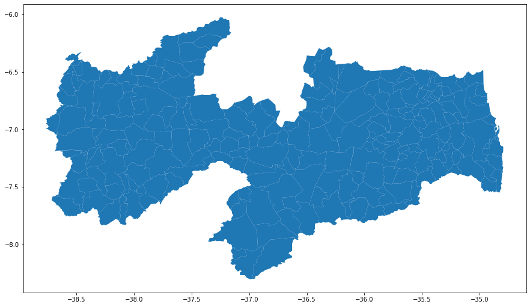
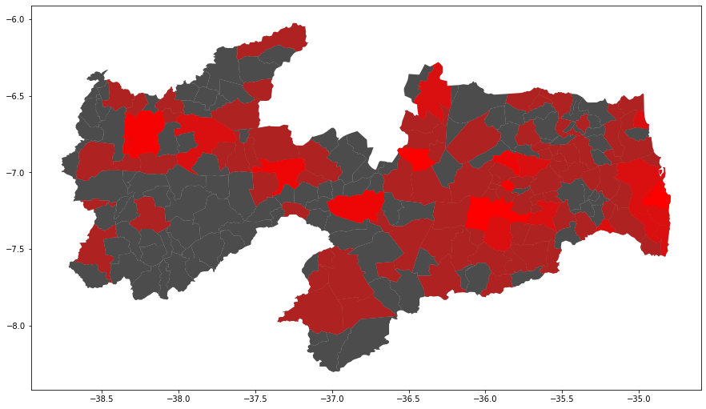

```python
%matplotlib inline
```


```python
import pandas as pd
import geopandas as gpd
import matplotlib as mpl
import matplotlib.cm as cm
import matplotlib.pyplot as plt
import mplcursors
import descartes

from geopy.geocoders import Nominatim
from shapely.geometry import Point, Polygon
```


```python
street_map = gpd.read_file('municipios/Municipios.shp')
# street_map = gpd.read_file('joaopessoa/bairros/Bairros.shp')
# street_map = gpd.read_file('joaopessoa/setores/Setores.shp')
```


```python
fig, ax = plt.subplots(figsize = (15,15))
street_map.plot(ax=ax)
```


    <matplotlib.axes._subplots.AxesSubplot at 0x7f2f2624a320>





```python
df=pd.read_csv('csv/producao.csv',encoding = "ISO-8859-1", sep =';',low_memory=False,
              usecols=['CD_ALUNO','MUNICIPIO_ENDERECO_ALUNO','UF_ENDERECO_ALUNO'])
# print(df.CD_ALUNO.size)
# print(df.drop_duplicates().CD_ALUNO.size)
df = df.drop_duplicates()
df.head()
```

    9446
    6463


<div>
<table border="1" class="dataframe">
  <thead>
    <tr style="text-align: right;">
      <th></th>
      <th>CD_ALUNO</th>
      <th>MUNICIPIO_ENDERECO_ALUNO</th>
      <th>UF_ENDERECO_ALUNO</th>
    </tr>
  </thead>
  <tbody>
    <tr>
      <th>0</th>
      <td>SGEPB00023728</td>
      <td>Santa Rita</td>
      <td>PB</td>
    </tr>
    <tr>
      <th>1</th>
      <td>SGEPB00020876</td>
      <td>Guarabira</td>
      <td>PB</td>
    </tr>
    <tr>
      <th>2</th>
      <td>SGEPB00024701</td>
      <td>Queimadas</td>
      <td>PB</td>
    </tr>
    <tr>
      <th>3</th>
      <td>SGEPB00017424</td>
      <td>Bayeux</td>
      <td>PB</td>
    </tr>
    <tr>
      <th>4</th>
      <td>SGEPB00023734</td>
      <td>Campina Grande</td>
      <td>PB</td>
    </tr>
  </tbody>
</table>
</div>


```python
df_pb = df[df['UF_ENDERECO_ALUNO'] == 'PB']
# print(df_pb.CD_ALUNO.size)
df_pb.head()
```

    6004


<div>
<table border="1" class="dataframe">
  <thead>
    <tr style="text-align: right;">
      <th></th>
      <th>CD_ALUNO</th>
      <th>MUNICIPIO_ENDERECO_ALUNO</th>
      <th>UF_ENDERECO_ALUNO</th>
    </tr>
  </thead>
  <tbody>
    <tr>
      <th>0</th>
      <td>SGEPB00023728</td>
      <td>Santa Rita</td>
      <td>PB</td>
    </tr>
    <tr>
      <th>1</th>
      <td>SGEPB00020876</td>
      <td>Guarabira</td>
      <td>PB</td>
    </tr>
    <tr>
      <th>2</th>
      <td>SGEPB00024701</td>
      <td>Queimadas</td>
      <td>PB</td>
    </tr>
    <tr>
      <th>3</th>
      <td>SGEPB00017424</td>
      <td>Bayeux</td>
      <td>PB</td>
    </tr>
    <tr>
      <th>4</th>
      <td>SGEPB00023734</td>
      <td>Campina Grande</td>
      <td>PB</td>
    </tr>
  </tbody>
</table>
</div>


```python
# df_jp = df[df['CIDADE'] == 'João Pessoa']
# df_jp.head()
```


```python
geolocator = Nominatim()
df_locations = pd.DataFrame(columns=['lat','lon'])
```

    /usr/local/lib/python3.6/dist-packages/ipykernel_launcher.py:1: DeprecationWarning: Using Nominatim with the default "geopy/1.20.0" `user_agent` is strongly discouraged, as it violates Nominatim's ToS https://operations.osmfoundation.org/policies/nominatim/ and may possibly cause 403 and 429 HTTP errors. Please specify a custom `user_agent` with `Nominatim(user_agent="my-application")` or by overriding the default `user_agent`: `geopy.geocoders.options.default_user_agent = "my-application"`. In geopy 2.0 this will become an exception.
      """Entry point for launching an IPython kernel.


```python
lat = []
lon = []
location=None
```


```python
# for bairro in df_jp['BAIRRO'].drop_duplicates():
for local in df_pb['MUNICIPIO_ENDERECO_ALUNO'].drop_duplicates():
    if type(local) is not str:
        continue

    try:
#         location = geolocator.geocode(bairro+" João Pessoa")
        location = geolocator.geocode(local+" Paraíba")
    except:
        pass
    
    if location is None:
        continue
    lat.append(location.raw['lat'])
    lon.append(location.raw['lon'])
```


```python
df_locations['lat'] = lat
df_locations['lon'] = lon
df_locations.head()
```


<div>
<table border="1" class="dataframe">
  <thead>
    <tr style="text-align: right;">
      <th></th>
      <th>lat</th>
      <th>lon</th>
    </tr>
  </thead>
  <tbody>
    <tr>
      <th>0</th>
      <td>-6.8513982</td>
      <td>-35.4915582</td>
    </tr>
    <tr>
      <th>1</th>
      <td>-7.3640404</td>
      <td>-35.9016644</td>
    </tr>
    <tr>
      <th>2</th>
      <td>-7.1301631</td>
      <td>-34.936532</td>
    </tr>
    <tr>
      <th>3</th>
      <td>-7.2246743</td>
      <td>-35.8771292</td>
    </tr>
    <tr>
      <th>4</th>
      <td>-7.1215981</td>
      <td>-34.882028</td>
    </tr>
  </tbody>
</table>
</div>


```python
df_locations.head()
```


<div>
<table border="1" class="dataframe">
  <thead>
    <tr style="text-align: right;">
      <th></th>
      <th>lat</th>
      <th>lon</th>
    </tr>
  </thead>
  <tbody>
    <tr>
      <th>0</th>
      <td>-6.8513982</td>
      <td>-35.4915582</td>
    </tr>
    <tr>
      <th>1</th>
      <td>-7.3640404</td>
      <td>-35.9016644</td>
    </tr>
    <tr>
      <th>2</th>
      <td>-7.1301631</td>
      <td>-34.936532</td>
    </tr>
    <tr>
      <th>3</th>
      <td>-7.2246743</td>
      <td>-35.8771292</td>
    </tr>
    <tr>
      <th>4</th>
      <td>-7.1215981</td>
      <td>-34.882028</td>
    </tr>
  </tbody>
</table>
</div>


```python
df_locations['lat'] = df_locations['lat'].astype(float)
df_locations['lon'] = df_locations['lon'].astype(float)
```


```python
df_locations = df_locations[(df_locations['lat']>float(ax.get_ylim()[0])) & (df_locations['lat']<float(ax.get_ylim()[1])) & 
           (df_locations['lon']>float(ax.get_xlim()[0])) & (df_locations['lon']<float(ax.get_xlim()[1]))]
```


```python
geometry = [Point(xy) for xy in zip(df_locations['lon'],df_locations['lat'])]
geometry[:3]
```


    [<shapely.geometry.point.Point at 0x7f2f23dcc518>,
     <shapely.geometry.point.Point at 0x7f2f23dcc470>,
     <shapely.geometry.point.Point at 0x7f2f23dcc358>]


```python
crs = {'init': 'epsg:4326'}
geo_df = gpd.GeoDataFrame(df_locations, crs = crs, geometry=geometry)
# geo_df = gpd.GeoDataFrame(df_bairros, geometry=geometry)
geo_df.head()
```


<div>
<table border="1" class="dataframe">
  <thead>
    <tr style="text-align: right;">
      <th></th>
      <th>lat</th>
      <th>lon</th>
      <th>geometry</th>
    </tr>
  </thead>
  <tbody>
    <tr>
      <th>0</th>
      <td>-6.851398</td>
      <td>-35.491558</td>
      <td>POINT (-35.4915582 -6.8513982)</td>
    </tr>
    <tr>
      <th>1</th>
      <td>-7.364040</td>
      <td>-35.901664</td>
      <td>POINT (-35.9016644 -7.3640404)</td>
    </tr>
    <tr>
      <th>2</th>
      <td>-7.130163</td>
      <td>-34.936532</td>
      <td>POINT (-34.936532 -7.1301631)</td>
    </tr>
    <tr>
      <th>3</th>
      <td>-7.224674</td>
      <td>-35.877129</td>
      <td>POINT (-35.8771292 -7.2246743)</td>
    </tr>
    <tr>
      <th>4</th>
      <td>-7.121598</td>
      <td>-34.882028</td>
      <td>POINT (-34.882028 -7.1215981)</td>
    </tr>
  </tbody>
</table>
</div>


```python
street_map['geometry'].head()
```


    0    POLYGON ((-37.70375999999851 -7.37317999999868...
    1    POLYGON ((-38.20503999999892 -7.00980999999774...
    2    POLYGON ((-35.53464999999778 -7.00936999999794...
    3    POLYGON ((-35.79565999999795 -7.02332999999816...
    4    POLYGON ((-35.56344999999783 -6.90759999999863...
    Name: geometry, dtype: object


```python
street_map['geometry'].head().contains(geo_df['geometry'].head())
```


    0    False
    1    False
    2    False
    3    False
    4    False
    dtype: bool


```python
geo_df['geometry'].head()
```


    0    POINT (-35.4915582 -6.8513982)
    1    POINT (-35.9016644 -7.3640404)
    2     POINT (-34.936532 -7.1301631)
    3    POINT (-35.8771292 -7.2246743)
    4     POINT (-34.882028 -7.1215981)
    Name: geometry, dtype: object


```python
# print(street_map.size)
street_map.head()
```

    2899


<div>
<table border="1" class="dataframe">
  <thead>
    <tr style="text-align: right;">
      <th></th>
      <th>OBJECTID</th>
      <th>GEOCODIG_M</th>
      <th>UF</th>
      <th>Sigla</th>
      <th>Nome_Munic</th>
      <th>Região</th>
      <th>Mesorregiã</th>
      <th>Nome_Meso</th>
      <th>Microrregi</th>
      <th>Nome_Micro</th>
      <th>Shape_Leng</th>
      <th>Shape_Area</th>
      <th>geometry</th>
    </tr>
  </thead>
  <tbody>
    <tr>
      <th>0</th>
      <td>1</td>
      <td>2500106.0</td>
      <td>25</td>
      <td>PB</td>
      <td>Água Branca</td>
      <td>Nordeste</td>
      <td>2501</td>
      <td>Sertão Paraibano</td>
      <td>25007</td>
      <td>Serra do Teixeira</td>
      <td>0.729661</td>
      <td>0.019337</td>
      <td>POLYGON ((-37.70375999999851 -7.37317999999868...</td>
    </tr>
    <tr>
      <th>1</th>
      <td>2</td>
      <td>2500205.0</td>
      <td>25</td>
      <td>PB</td>
      <td>Aguiar</td>
      <td>Nordeste</td>
      <td>2501</td>
      <td>Sertão Paraibano</td>
      <td>25005</td>
      <td>Piancó</td>
      <td>0.969734</td>
      <td>0.028152</td>
      <td>POLYGON ((-38.20503999999892 -7.00980999999774...</td>
    </tr>
    <tr>
      <th>2</th>
      <td>3</td>
      <td>2500304.0</td>
      <td>25</td>
      <td>PB</td>
      <td>Alagoa Grande</td>
      <td>Nordeste</td>
      <td>2503</td>
      <td>Agreste Paraibano</td>
      <td>25015</td>
      <td>Brejo Paraibano</td>
      <td>0.789787</td>
      <td>0.026308</td>
      <td>POLYGON ((-35.53464999999778 -7.00936999999794...</td>
    </tr>
    <tr>
      <th>3</th>
      <td>4</td>
      <td>2500403.0</td>
      <td>25</td>
      <td>PB</td>
      <td>Alagoa Nova</td>
      <td>Nordeste</td>
      <td>2503</td>
      <td>Agreste Paraibano</td>
      <td>25015</td>
      <td>Brejo Paraibano</td>
      <td>0.500304</td>
      <td>0.009923</td>
      <td>POLYGON ((-35.79565999999795 -7.02332999999816...</td>
    </tr>
    <tr>
      <th>4</th>
      <td>5</td>
      <td>2500502.0</td>
      <td>25</td>
      <td>PB</td>
      <td>Alagoinha</td>
      <td>Nordeste</td>
      <td>2503</td>
      <td>Agreste Paraibano</td>
      <td>25016</td>
      <td>Guarabira</td>
      <td>0.444048</td>
      <td>0.007825</td>
      <td>POLYGON ((-35.56344999999783 -6.90759999999863...</td>
    </tr>
  </tbody>
</table>
</div>


```python
a = pd.DataFrame(columns=street_map.columns)
lat_list = []
lon_list = []
for i in range(street_map.geometry.size):
    for lat, lon, point in geo_df[['lat','lon','geometry']].values:
        if point.within(street_map.loc[i,'geometry']):
            lat_list.append(lat)
            lon_list.append(lon)
            a = a.append(street_map.loc[i,:], ignore_index=True)

a['lat'] = lat_list
a['lon'] = lon_list
a = gpd.GeoDataFrame(a, crs = crs, geometry=a.geometry)
# print(a.size)
a.head()
```

    2385


<div>
<table border="1" class="dataframe">
  <thead>
    <tr style="text-align: right;">
      <th></th>
      <th>OBJECTID</th>
      <th>GEOCODIG_M</th>
      <th>UF</th>
      <th>Sigla</th>
      <th>Nome_Munic</th>
      <th>Região</th>
      <th>Mesorregiã</th>
      <th>Nome_Meso</th>
      <th>Microrregi</th>
      <th>Nome_Micro</th>
      <th>Shape_Leng</th>
      <th>Shape_Area</th>
      <th>geometry</th>
      <th>lat</th>
      <th>lon</th>
    </tr>
  </thead>
  <tbody>
    <tr>
      <th>0</th>
      <td>3</td>
      <td>2500304.0</td>
      <td>25</td>
      <td>PB</td>
      <td>Alagoa Grande</td>
      <td>Nordeste</td>
      <td>2503</td>
      <td>Agreste Paraibano</td>
      <td>25015</td>
      <td>Brejo Paraibano</td>
      <td>0.789787</td>
      <td>0.026308</td>
      <td>POLYGON ((-35.53464999999778 -7.00936999999794...</td>
      <td>-7.041521</td>
      <td>-35.628532</td>
    </tr>
    <tr>
      <th>1</th>
      <td>4</td>
      <td>2500403.0</td>
      <td>25</td>
      <td>PB</td>
      <td>Alagoa Nova</td>
      <td>Nordeste</td>
      <td>2503</td>
      <td>Agreste Paraibano</td>
      <td>25015</td>
      <td>Brejo Paraibano</td>
      <td>0.500304</td>
      <td>0.009923</td>
      <td>POLYGON ((-35.79565999999795 -7.02332999999816...</td>
      <td>-7.060115</td>
      <td>-35.761457</td>
    </tr>
    <tr>
      <th>2</th>
      <td>5</td>
      <td>2500502.0</td>
      <td>25</td>
      <td>PB</td>
      <td>Alagoinha</td>
      <td>Nordeste</td>
      <td>2503</td>
      <td>Agreste Paraibano</td>
      <td>25016</td>
      <td>Guarabira</td>
      <td>0.444048</td>
      <td>0.007825</td>
      <td>POLYGON ((-35.56344999999783 -6.90759999999863...</td>
      <td>-6.948031</td>
      <td>-35.545793</td>
    </tr>
    <tr>
      <th>3</th>
      <td>8</td>
      <td>2500601.0</td>
      <td>25</td>
      <td>PB</td>
      <td>Alhandra</td>
      <td>Nordeste</td>
      <td>2504</td>
      <td>Mata Paraibana</td>
      <td>25023</td>
      <td>Litoral Sul</td>
      <td>0.758517</td>
      <td>0.015012</td>
      <td>POLYGON ((-34.92604999999821 -7.27260999999816...</td>
      <td>-7.430425</td>
      <td>-34.910610</td>
    </tr>
    <tr>
      <th>4</th>
      <td>8</td>
      <td>2500601.0</td>
      <td>25</td>
      <td>PB</td>
      <td>Alhandra</td>
      <td>Nordeste</td>
      <td>2504</td>
      <td>Mata Paraibana</td>
      <td>25023</td>
      <td>Litoral Sul</td>
      <td>0.758517</td>
      <td>0.015012</td>
      <td>POLYGON ((-34.92604999999821 -7.27260999999816...</td>
      <td>-7.430425</td>
      <td>-34.910610</td>
    </tr>
  </tbody>
</table>
</div>


```python
fig, ax = plt.subplots(figsize = (15,15))
street_map.plot(ax=ax, alpha=0.7, color='black')
im = a.plot(ax=ax, alpha=0.55, color='red')

plt.show()
```





```python
street_map.head()
```


<div>
<table border="1" class="dataframe">
  <thead>
    <tr style="text-align: right;">
      <th></th>
      <th>OBJECTID</th>
      <th>GEOCODIG_M</th>
      <th>UF</th>
      <th>Sigla</th>
      <th>Nome_Munic</th>
      <th>Região</th>
      <th>Mesorregiã</th>
      <th>Nome_Meso</th>
      <th>Microrregi</th>
      <th>Nome_Micro</th>
      <th>Shape_Leng</th>
      <th>Shape_Area</th>
      <th>geometry</th>
    </tr>
  </thead>
  <tbody>
    <tr>
      <th>0</th>
      <td>1</td>
      <td>2500106.0</td>
      <td>25</td>
      <td>PB</td>
      <td>Água Branca</td>
      <td>Nordeste</td>
      <td>2501</td>
      <td>Sertão Paraibano</td>
      <td>25007</td>
      <td>Serra do Teixeira</td>
      <td>0.729661</td>
      <td>0.019337</td>
      <td>POLYGON ((-37.70375999999851 -7.37317999999868...</td>
    </tr>
    <tr>
      <th>1</th>
      <td>2</td>
      <td>2500205.0</td>
      <td>25</td>
      <td>PB</td>
      <td>Aguiar</td>
      <td>Nordeste</td>
      <td>2501</td>
      <td>Sertão Paraibano</td>
      <td>25005</td>
      <td>Piancó</td>
      <td>0.969734</td>
      <td>0.028152</td>
      <td>POLYGON ((-38.20503999999892 -7.00980999999774...</td>
    </tr>
    <tr>
      <th>2</th>
      <td>3</td>
      <td>2500304.0</td>
      <td>25</td>
      <td>PB</td>
      <td>Alagoa Grande</td>
      <td>Nordeste</td>
      <td>2503</td>
      <td>Agreste Paraibano</td>
      <td>25015</td>
      <td>Brejo Paraibano</td>
      <td>0.789787</td>
      <td>0.026308</td>
      <td>POLYGON ((-35.53464999999778 -7.00936999999794...</td>
    </tr>
    <tr>
      <th>3</th>
      <td>4</td>
      <td>2500403.0</td>
      <td>25</td>
      <td>PB</td>
      <td>Alagoa Nova</td>
      <td>Nordeste</td>
      <td>2503</td>
      <td>Agreste Paraibano</td>
      <td>25015</td>
      <td>Brejo Paraibano</td>
      <td>0.500304</td>
      <td>0.009923</td>
      <td>POLYGON ((-35.79565999999795 -7.02332999999816...</td>
    </tr>
    <tr>
      <th>4</th>
      <td>5</td>
      <td>2500502.0</td>
      <td>25</td>
      <td>PB</td>
      <td>Alagoinha</td>
      <td>Nordeste</td>
      <td>2503</td>
      <td>Agreste Paraibano</td>
      <td>25016</td>
      <td>Guarabira</td>
      <td>0.444048</td>
      <td>0.007825</td>
      <td>POLYGON ((-35.56344999999783 -6.90759999999863...</td>
    </tr>
  </tbody>
</table>
</div>


